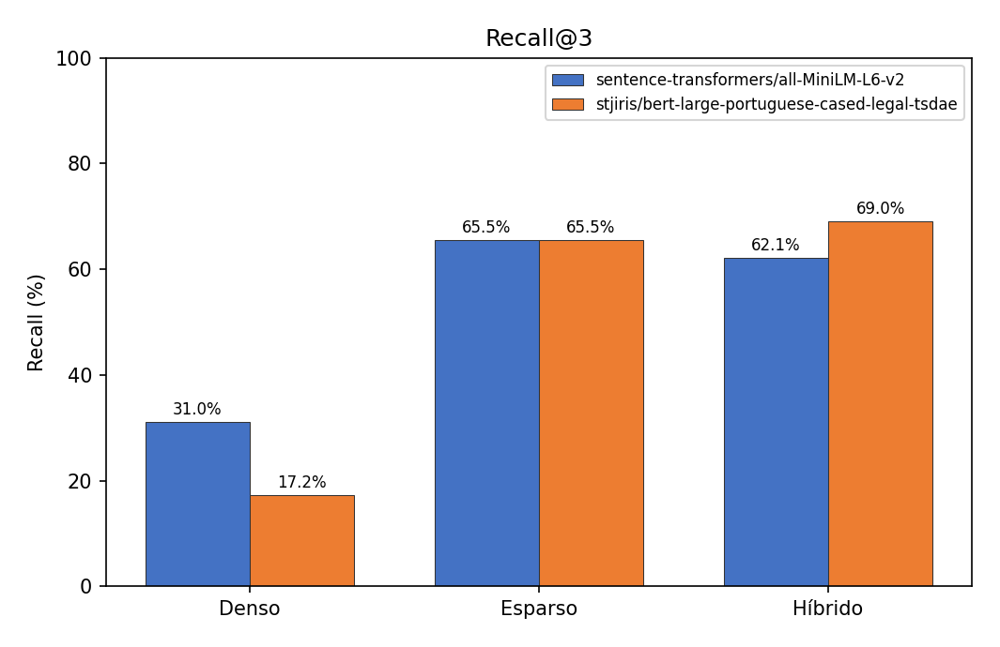
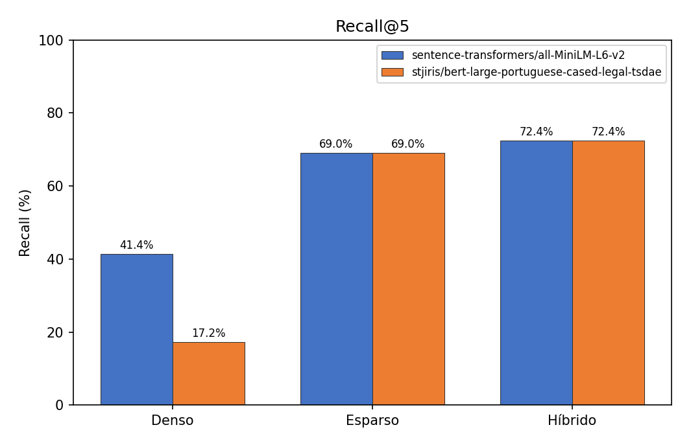
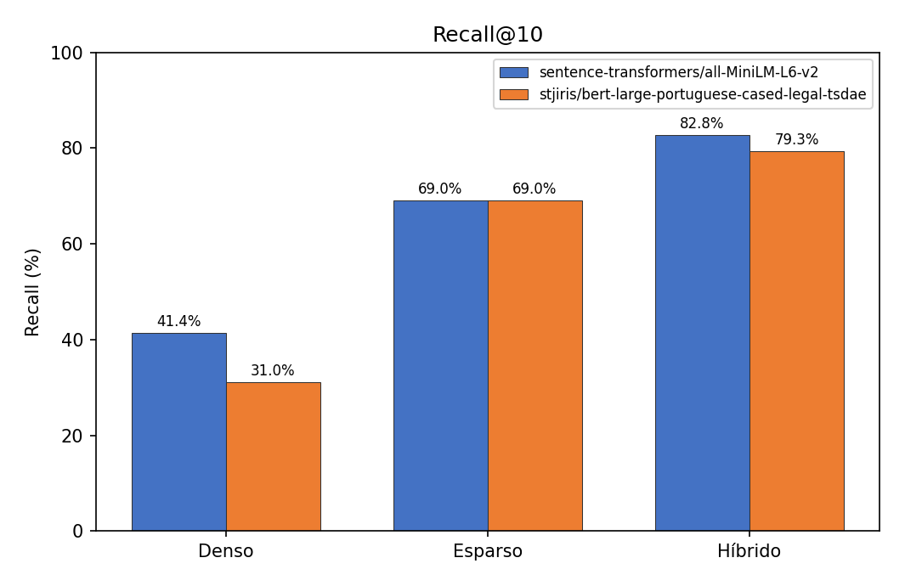

# Relatorio de Validacao e Avaliacao do RAG (PR5, PR6 e PR7)

## 1. Visao Geral

Este documento apresenta os resultados da avaliacao formal do sistema de Retrieval-Augmented Generation (RAG) para Pareceres Tributarios da SEFAZ-GO. O objetivo desta fase foi medir matematicamente a qualidade da recuperacao de informacao (PR5), consolidar a exposicao dos modos de busca na interface (PR6) e registrar os artefatos finais da etapa experimental (PR7).

## 2. Artefatos Produzidos

Foi utilizado um Golden Set em Excel com perguntas de negocio e documento esperado, consumido diretamente pela etapa:

```powershell
python src/pipeline.py --step evaluate --golden-file Golden_Set_Preenchido_pelo_RAG_Reranked.xlsx --k 5
```

Na execucao consolidada nesta fase, a avaliacao considerou **29** perguntas com gabarito utilizavel (linhas com `documento_esperado` preenchido; entradas `Nenhum` ou vazias ficam de fora do denominador do Recall). O ficheiro inclui tambem itens fora do corpus para rubrica de recusa, que nao entram nesta metrica.

## 3. Estrategias Avaliadas

Foram comparadas tres estrategias de recuperacao:

- Denso (embeddings): recuperacao semantica por vetores.
- Esparso (BM25): recuperacao lexical por frequencia exata de termos.
- Hibrido (RRF): combinacao entre denso e esparso por Reciprocal Rank Fusion.

## 4. Baseline Confirmada

Baseline **MiniLM** (`sentence-transformers/all-MiniLM-L6-v2`): **Recall@k** por modo de recuperacao, com os **29** casos do golden set utilizados na consolidacao de `docs/dados/recall_por_k.json` (actualizado em 2026-03-29).

| k | Modo | Recall (%) | acertos/total |
|---|------|------------|---------------|
| 3 | Denso | 31,03 | 9/29 |
| 3 | Esparso | 65,52 | 19/29 |
| 3 | Hibrido | 62,07 | 18/29 |
| 5 | Denso | 41,38 | 12/29 |
| 5 | Esparso | 68,97 | 20/29 |
| 5 | Hibrido | 72,41 | 21/29 |
| 10 | Denso | 41,38 | 12/29 |
| 10 | Esparso | 68,97 | 20/29 |
| 10 | Hibrido | 82,76 | 24/29 |

Resumo da linha **k = 5** (golden set alargado face a corridas anteriores com 26 itens):

- Modo Denso: Recall@5 de **41,38%** (12/29 acertos)
- Modo Esparso: Recall@5 de **68,97%** (20/29 acertos)
- Modo Hibrido: Recall@5 de **72,41%** (21/29 acertos)

## 5. Experimento com Embedding Juridico

Tabela consolidada de **Recall@k** (denso, esparso, hibrido) para o baseline **MiniLM** (`sentence-transformers/all-MiniLM-L6-v2`) e o embedding **juridico** (`stjiris/bert-large-portuguese-cased-legal-tsdae`). Valores obtidos via `run_evaluate` e registados em `docs/dados/recall_por_k.json` (**29** perguntas com gabarito utilizavel nesta execucao).

| k | Modo | MiniLM — Recall (%) | MiniLM — acertos/total | BERT legal — Recall (%) | BERT legal — acertos/total |
|---|------|---------------------|------------------------|-------------------------|----------------------------|
| 3 | Denso | 31,03 | 9/29 | 17,24 | 5/29 |
| 3 | Esparso | 65,52 | 19/29 | 65,52 | 19/29 |
| 3 | Hibrido | 62,07 | 18/29 | 68,97 | 20/29 |
| 5 | Denso | 41,38 | 12/29 | 17,24 | 5/29 |
| 5 | Esparso | 68,97 | 20/29 | 68,97 | 20/29 |
| 5 | Hibrido | 72,41 | 21/29 | 72,41 | 21/29 |
| 10 | Denso | 41,38 | 12/29 | 31,03 | 9/29 |
| 10 | Esparso | 68,97 | 20/29 | 68,97 | 20/29 |
| 10 | Hibrido | 82,76 | 24/29 | 79,31 | 23/29 |

Foi realizado um experimento controlado alterando apenas o modelo de embeddings para:

- `stjiris/bert-large-portuguese-cased-legal-tsdae`

Resultado obtido (linha **k = 5** da tabela acima, BERT legal):

- Modo Denso: Recall@5 de **17,24%** (5/29 acertos)
- Modo Esparso: Recall@5 de **68,97%** (20/29 acertos)
- Modo Hibrido: Recall@5 de **72,41%** (21/29 acertos)

## 6. Conclusao Tecnica

Para avaliacao do modelo foi construído um script capaz de rodar ambos os modelos em k-posições necessárias. Para tal, rode (para k IN (3, 5 e 10)):

```powershell
python scripts/run_recall_at_k_values.py --k-values 3,5,10
```







Com o golden set **atual (29 perguntas validas)**, o embedding juridico **mantem desvantagem clara no modo denso** face ao MiniLM (por exemplo, Recall@5 de **17,24%** frente a **41,38%**). No modo **esparso**, os dois modelos **empatam** em todos os k reportados (mesmos acertos/total, por o BM25 nao depender do embedding). No modo **hibrido**, para **Recall@5** os dois embeddings produzem **o mesmo resultado: 72,41%** (21/29); para **Recall@10**, o **MiniLM** fica ligeiramente **acima** (**82,76%** ou 24/29) do BERT legal (**79,31%** ou 23/29).

Em sintese, apos o alargamento do conjunto de testes, o ganho exclusivo do BERT no hibrido observado na versao anterior do relatorio **deixa de aparecer em k = 5** (empate). A **Trilha A** continua relevante porque o **hibrido** supera denso e esparso isolados em varios cenarios; a escolha do embedding deve equilibrar **custo/tempo** (BERT maior) e o facto de, neste conjunto, o **MiniLM** ainda ser **superior ou igual** ao BERT no denso e no hibrido em **k = 10**.

## 7. Implementacao na Interface

A interface em Streamlit foi desenhada para espelhar estas escolhas tecnicas no contacto com o utilizador. Na barra lateral, e possivel alternar entre **Hibrido**, **Denso** e **Esparso**, de modo que a mesma pergunta possa ser respondida com estrategias distintas sem sair da aplicacao. Isto aproxima a demonstracao oral do que o relatório quantifica: o utilizador ve a resposta com citacoes, pode abrir o painel de trechos recuperados e, ao mudar o modo, observa diretamente como mudam os chunks que sustentam o RAG.

## 8. Analise por rubrica qualitativa

Esta secção incorpora as anotações do ficheiro **`rubrica_qualitativa.xlsx`** (na raiz do projeto; folha `rubrica_qualitativa`), com **15** linhas de avaliação: **5** perguntas do golden set (linhas 1, 2, 3, 23 e 32) cruzadas com os **três** modos de recuperação (**Híbrido**, **Denso**, **Esparso** / BM25).

### 8.1 Critérios utilizados

Para cada execução foram registadas notas (escala numérica em geral de 1 a 5, salvo `N/D` quando o critério não se aplicava) e comentários livres:

| Critério | Significado na rubrica (uso neste trabalho) |
|----------|-----------------------------------------------|
| **Groundedness** | A resposta permanece ancorada nos trechos recuperados? |
| **Correção** | Alinhamento com o conteúdo normativo/factual esperado para a pergunta. |
| **Citações** | Uso adequado das referências `[[TRECHO_n]]` / coerência com as fontes. |
| **Alucinação** | Nota alta = pouca ou nenhuma invenção em relação ao corpus (conforme a convenção da folha). |
| **Recusa** | Quando aplicável (ex.: tema fora do corpus), capacidade de recusar em vez de inventar. |

As **observações** textuais da folha resumem-se abaixo, preservando o critério do avaliador.

### 8.2 Síntese por pergunta e modo

**Pergunta 1 (linha golden 1)** — *O que é fundeinfra?*

| Modo | G | C | Cit | Alu | Rec | Observações (resumo) |
|------|---|---|-----|-----|-----|----------------------|
| Híbrido | 5 | 4 | 5 | 5 | N/D | Cita o Fundeinfra mas erra número da lei, não cita ICMS; resposta longa e desfocada do cerne da pergunta. |
| Denso | 1 | 1 | 1 | 5 | N/D | Não encontrou resposta útil (falha de recuperação / resposta vazia). |
| **Esparso (BM25)** | **5** | **5** | **5** | **5** | N/D | **Melhor resposta global** na rubrica. |

**Pergunta 2 (linha golden 2)** — *Empresa de SP, duas vendas de máquinas (não contribuinte R$ 100 mil e contribuinte R$ 200 mil): quanto pagar de DIFAL para Goiás?*

| Modo | G | C | Cit | Alu | Rec | Observações (resumo) |
|------|---|---|-----|-----|-----|----------------------|
| Híbrido | 5 | 2 | 3 | 5 | N/D | Raciocínio invertido; acertou o parecer; errou o cálculo. |
| Denso | 5 | 3 | 3 | 5 | N/D | Acertou parecer e cálculo, mas não usou bem o parecer na formulação da resposta. |
| Esparso (BM25) | 5 | 2 | 3 | 5 | N/D | Usou o parecer de forma coerente; errou cálculo e base de cálculo. |

Neste caso a **correção** ficou ligeiramente melhor no **Denso**, mas todos falham em parte no cálculo ou na articulação; a rubrica destaca sobretudo **grounding** estável nos três.

**Pergunta 3 (linha golden 3)** — *A construtora é obrigada a fazer a Escrituração Fiscal Digital?*

| Modo | G | C | Cit | Alu | Rec | Observações (resumo) |
|------|---|---|-----|-----|-----|----------------------|
| Híbrido | 5 | 2 | 5 | 5 | N/D | Coerente com o documento recuperado, mas não coincide com a resposta esperada do golden. |
| Denso | 1 | 1 | 1 | 1 | N/D | Não encontrou resposta. |
| **Esparso (BM25)** | **5** | **2** | **5** | **5** | N/D | Mesma linha do híbrido quanto ao alinhamento com o gabarito, com resposta **mais sucinta e direta**. |

**Pergunta 23 (linha golden 23)** — *Caminhonete é veículo utilitário?*

| Modo | G | C | Cit | Alu | Rec | Observações (resumo) |
|------|---|---|-----|-----|-----|----------------------|
| **Híbrido** | **5** | **5** | **5** | **1** | N/D | **Melhor conjunto** na rubrica: chunks fortes no top-3, resposta coesa (IPVA, órgão competente). |
| Denso | 2 | 1 | 5 | 1 | N/D | Parecer correto fora do top-5; trechos sem correlação temática (ex.: combustíveis). |
| Esparso (BM25) | 5 | 4 | 5 | 5 | N/D | Top-4 alinhados ao parecer esperado; resposta um pouco aberta quanto ao “modelo”; falta explicitar competência estadual. |

**Pergunta 32 (linha golden 32)** — *Quais requisitos da ANVISA para registro de cosmético importado (petição, taxas e documentação técnica)?* (intencionalmente **fora do corpus** tributário GO)

| Modo | G | C | Cit | Alu | Rec | Observações (resumo) |
|------|---|---|-----|-----|-----|----------------------|
| Híbrido | 5 | 1 | 5 | 1 | 1 | Alucinação: afirma sem corpus ANVISA; texto ainda “colado” a chunks errados. |
| **Denso** | **5** | **5** | **5** | **5** | **5** | **Recusa clara** pela ausência de informação no corpus (melhor comportamento de segurança). |
| Esparso (BM25) | 1 | 1 | 1 | 1 | 1 | Alucinação grave (incl. troca de idioma na anotação). |

*(Legenda: G = groundedness, C = correcao, Cit = citacoes, Alu = alucinacao, Rec = recusa.)*

### 8.3 Justificativa da melhor escolha do modelo **BM25** (modo esparso)

Com base **somente** nas anotações de `rubrica_qualitativa.xlsx` (raiz do projeto) e em alinhamento com o **Recall@k** já reportado (onde o **esparso** supera o **denso** em vários k):

1. **Termos jurídicos e siglas** — Perguntas como *Fundeinfra* ou *Escrituração Fiscal Digital* beneficiam da **coincidência lexical** com os pareceres. O **BM25** promove documentos em que esses tokens aparecem com frequência e relevância estatística; na rubrica, o **denso falhou por completo** nas perguntas 1 e 3 (notas mínimas e “não encontrou resposta”), enquanto o **esparso** manteve **groundedness e citações altas** e foi classificado como **melhor resposta** no caso Fundeinfra.

2. **Robustez quando o embedding denso desvia** — No caso **caminhonete / veículo utilitário**, o avaliador registra que o **denso** recuperou trechos **fora do tema** (ainda no “universo” tributário, mas irrelevantes). O **BM25** manteve **quatro** chunks do parecer esperado no topo, com **menos dispersão semântica** para esta formulação da pergunta.

3. **Consistência com a métrica automática** — O **Recall@5** esparso (**68,97%**, 20/29) já indicava vantagem sobre o denso (**41,38%**, 12/29) no mesmo golden; a rubrica **confirma qualitativamente** que, em perguntas **ancoradas no léxico** dos pareceres de Goiás, o **esparso é frequentemente o modo mais seguro** quando o utilizador não reformula a pergunta em linguagem “próxima” do espaço semântico do modelo de embeddings.

4. **Ressalva obrigatória: temas fora do corpus** — Na pergunta **ANVISA**, o **BM25** obteve **piores** notas em todos os critérios e **alucinação** explícita na rubrica; o **denso** foi o único a **recusar** corretamente. Logo, a “melhor escolha” do BM25 **não é universal**: para **consultas claramente ausentes** do acervo, o relatório recomenda **priorizar o modo denso** (ou políticas de recusa no LLM) e tratar o **esparso** como **complementar** no **híbrido**, não como substituto cego em cenários de *out-of-domain*.

Em síntese, para o **domínio deste chatbot** (pareceres tributários GO com perguntas ricas em **nomes de institutos, normas e fatos concretos**), a rubrica qualitativa **reforça o BM25** como **baseline forte** frente ao denso isolado, **coerente** com o Recall quantitativo, com a **exceção documentada** de perguntas **sem suporte no corpus**, onde o **denso** foi superior na **recusa**.
